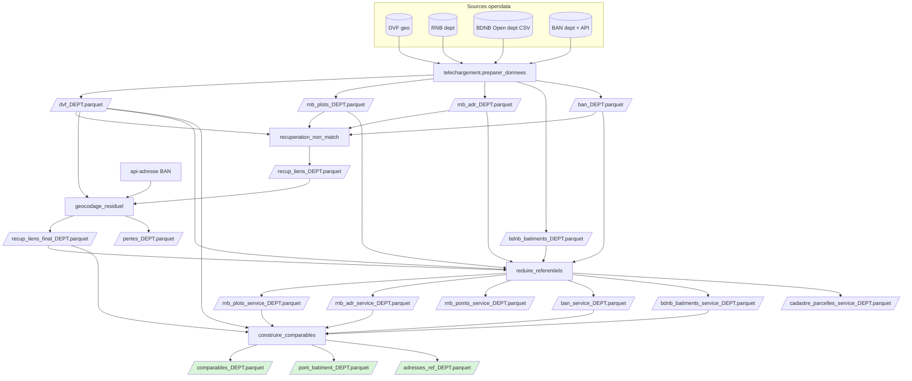
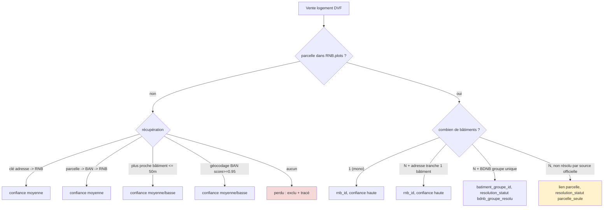

# Pipeline — du foncier brut à la table de comparables

Ce document décrit le pipeline **actuel** : ce qu'il fait, comment il s'enchaîne, les
**choix** qui le structurent et ses **limites**. Pour le *pourquoi* détaillé de chaque
décision, voir les ADR liés ([0001](adr/0001-valider-joignabilite-avant-de-figer-le-socle.md)
→ [0006](adr/0006-bdnb-parcelle-pour-resolution-batiment.md)).

## But

Produire, **par département**, une table de **comparables immobiliers** centrée sur les ventes
de logement (DVF), chaque vente étant rattachée — quand c'est possible — au **bâtiment** du
Référentiel National des Bâtiments (RNB), avec un niveau de **confiance** explicite. Tout ce
qui n'est pas rattachable de façon défendable est soit localisé à la **parcelle**, soit
**écarté** et tracé (`pertes`).

## Sources

| Source | Rôle | Accès |
| --- | --- | --- |
| **DVF géolocalisé** (Etalab) | les ventes (prix, surface, type, parcelle, coords) | `geo-dvf` CSV/dept/an (2021–2025) |
| **RNB** (IGN/CSTB) | le pivot bâtiment (`rnb_id`), empreinte, parcelles, adresses | export S3 par département |
| **BDNB Open** (CSTB) | enrichissement bâtiment groupe par parcelle | ZIP CSV départemental `bdnb_millesime_2026-02-a` |
| **BAN** (DINUM) | crosswalk parcelle↔adresse + géocodage | fichier dept + API `api-adresse` |
| **Adresses extraites du cadastre** (DGFiP/Etalab) | lien **direct** parcelle↔adresse (source primaire BAN, `codesParcelles` + `destinationPrincipale`) | NDJSON-full par dept |
| **Contours communes** (geo.api.gouv.fr / IGN) | emprise « commune » + briques des contours code postal | GeoJSON par dept (1 appel), figé en local |
| **COG** (INSEE) | normalisation des codes communes périmés (fusions) + nom courant | `v_commune` + `v_mvt_commune` (national, figé en local) |

## Architecture

```
telechargement/      _telechargement.py         # download HTTP robuste partagé (écriture atomique + retry exp-backoff)
                     preparer_donnees.py        # acquisition COMPLÈTE d'un dept (DVF/RNB/BDNB/BAN/communes/COG/cadastre) ; normalise les codes communes périmés ; vérifie la complétude (arrêt net si manque)
                     preparer_passage_communes.py # COG INSEE -> passage codes périmés + noms courants (national)
                     preparer_communes.py       # contours communes IGN (geo.api) -> GeoParquet (par dept)
                     preparer_cadastre.py       # cadastre Etalab (sections/parcelles/bâtiments/lieux-dits) -> GeoParquet (par dept) — appelé par preparer_donnees
                     preparer_adresses_parcelle.py # crosswalk DIRECT parcelle↔adresse (NDJSON cadastre + BAN cad_parcelles, fusionnés + harmonisés) -> GeoParquet (par dept) — appelé par preparer_donnees
                     preparer_codes_postaux.py  # contours codes postaux hybrides (union communes + partition BAN) -> GeoParquet (par dept présent)
pipeline/
  commun.py          # chemins, points RNB, table mutations (partagés)
  qualite_jointure.py        # [diagnostic] mesure du taux de match
  recuperation_non_match.py  # cascade de récupération A/B/C
  geocodage_residuel.py      # géocodage BAN des résiduels + pertes
  reduire_referentiels.py    # filtre RNB/BAN/BDNB/Cadastre au graphe DVF utile
  construire_comparables.py  # table comparables + pont + adresses_ref
lancer_pipeline.py   # orchestre tout pour un département
```

## Vue d'ensemble



## Les étapes

| # | Module | Entrée | Sortie | Rôle |
| --- | --- | --- | --- | --- |
| 1 | `telechargement.preparer_donnees` | URLs opendata + ZIP BDNB dept | `dvf_`, `rnb_plots_`, `rnb_adr_`, `bdnb_batiments_`, `contours_communes_`, `cadastre_{sections,parcelles,batiments,lieux_dits}_`, `parcelle_adresse_`, `passage_communes`, `communes_actuelles`, `communes_modif` (parquet) + bruts | **acquisition complète** : DVF (2021-25), JSON RNB (`plots`, `addresses`), BDNB départementale par parcelle, BAN, contours communes IGN (geo.api), **cadastre Etalab** (sections/parcelles/bâtiments/lieux-dits) et **crosswalk direct parcelle↔adresse** (`parcelle_adresse_`, cf. SOURCES_DONNEES §3.3). **Normalise les codes communes périmés** (fusions) + nom vers le COG courant (cf. SOURCES_DONNEES §1.5). Termine par `_verifier` qui **garantit la présence de tous les artefacts** (arrêt net sinon) — la construction ne démarre jamais sur une acquisition incomplète |
| — | `pipeline.qualite_jointure` *(diagnostic)* | interim | (stdout) | mesure le % de match DVF→RNB par parcelle et décompose les non-matchs |
| 2 | `pipeline.recuperation_non_match` | interim + BAN | `recup_liens_` | récupère les ~2–5% de ventes dont la parcelle est absente du RNB |
| 3 | `pipeline.geocodage_residuel` | `recup_liens_` + DVF + API BAN | `recup_liens_final_`, `pertes_` | géocode le résiduel (score ≥ 0,95) ; le reste = perdu |
| 4 | `pipeline.reduire_referentiels` | interim complet + `recup_liens_final_` | `*_service_` | réduit RNB, BAN, BDNB et Cadastre aux parcelles DVF + bâtiments récupérés |
| 5 | `pipeline.construire_comparables` | DVF + artefacts service + `recup_liens_final_` | `comparables_`, `pont_batiment_`, `adresses_ref_` | assemble la table de service |

### Le cœur : résolution `rnb_id` + confiance

Le rattachement au bâtiment suit une cascade par fiabilité décroissante. Les non-matchs
(parcelle absente du RNB) passent par la récupération (étapes 2-3) ; les matchs directs sont
résolus à la construction (étape 4).



## Modèle de données (sorties)

- **`comparables_{dept}`** — 1 ligne par **bien logement vendu** (dédoublonné des lignes DVF
  éclatées). Colonnes : `id_mutation, date_mutation, nature_mutation, code_commune, nom_commune,
  id_parcelle, adresse_dvf, type_local, surface_reelle_bati, nombre_pieces_principales,
  valeur_fonciere, rnb_id, batiment_groupe_id, resolution_statut, confiance, source,
  flag_multi_bien, flag_multi_adresse, commune_modif_origine, commune_modif_date`.
  Les deux dernières tracent une **modification de commune** (fusion / renommage COG) :
  identité d'origine `Nom (CODE)` + date de l'événement, non nulles seulement si la commune
  de la vente a changé depuis (affichées au détail du bien).
- **`pont_batiment_{dept}`** — `(id_mutation, id_parcelle) → rnb_id, batiment_groupe_id,
  resolution_statut, confiance, source`. Autorité du rattachement, **unique par couple**
  (aucune duplication de ligne en aval).
- **`adresses_ref_{dept}`** — `rnb_id, cle_interop_ban, adresse_normalisee, code_postal,
  nom_commune, lon, lat`, **élagué** aux `rnb_id` réellement référencés (~5-6 % du RNB).
- **`parcelle_adresse_{dept}`** — crosswalk **direct** `id_parcelle → {numero, voie, code_postal, ville, code_insee, lon, lat, destination, source}` (une ligne par couple parcelle↔adresse), **indépendant du pivot RNB** : comble les parcelles sans bâtiment RNB adressé. Fusion NDJSON cadastre (primaire, porte `destination`) + BAN `cad_parcelles`, **dédupliquée à la source** sur clé canonique numéro+voie+commune (affichage = libellé BAN officiel quand dispo, `destination` cadastre préservée — cf. SOURCES_DONNEES §3.3). **Couvre toutes les parcelles** (≠ artefacts `*_service` réduits au graphe DVF) : la carte interroge n'importe quelle parcelle. Proxy d'adresse propriétaire, **pas** l'identité (Fichiers Fonciers/MAJIC, accès restreint).
- **`pertes_{dept}`** — ventes non rattachables + `raison`.
- **`*_service_{dept}`** — projections de RNB/BAN/BDNB/Cadastre limitées au graphe DVF utile :
  parcelles présentes dans DVF et `rnb_id` récupérés par la cascade.

## Choix structurants

1. **Pivot = bâtiment RNB (`rnb_id`)**, parcelle = lien secondaire ([ADR 0003](adr/0003-rnb-pivot-batiment.md)).
2. **Parquet canonique + DuckDB en service**, pas de PostGIS ([ADR 0002](adr/0002-parquet-duckdb-comme-moteur-de-service.md)).
3. **Récupération en cascade + seuil de perte 0,95** : un faux rattachement coûte plus cher
   qu'une perte assumée ([ADR 0004](adr/0004-recuperation-non-matchs-dvf-rnb.md)).
4. **Grain = bien logement**, `valeur_fonciere` = total mutation jamais sommé, BAN élagué
   ([ADR 0005](adr/0005-organisation-des-donnees-table-comparables.md)).
5. **Filtres d'emprise poussés dans DuckDB** : tout endpoint de service doit réduire le jeu
   de données le plus tôt possible (bbox SQL avant distance exacte pour les rayons, `code_postal`,
   `code_commune`, préfixe section cadastrale sur `id_parcelle`). Les filtres métier récurrents
   (catégorie, bornes €/m², ventes mono-mutation) se matérialisent ou se calculent côté DuckDB,
   pas par scan départemental suivi d'un filtrage Python.
6. **BDNB seulement par clé officielle parcelle** : pas de relation RNB ext_ids -> BDNB groupe
   inventée. Une parcelle BDNB à groupe unique résout `batiment_groupe_id`; sinon la parcelle
   reste un contexte sourcé ([ADR 0006](adr/0006-bdnb-parcelle-pour-resolution-batiment.md)).
7. **Les référentiels de service sont réduits à DVF.** L'application chiffre depuis les ventes
   DVF ; les référentiels complets ne servent qu'en cache brut ou pendant la récupération des
   non-matchs. Les requêtes de service consomment les artefacts `*_service_{dept}`.

## Conventions de service web

Le POC web (`web_poc/`) sert de modèle pour les futures fonctions interactives :

- Les requêtes Estimation et Exploration construisent d'abord une **emprise SQL** commune :
  rayon = préfiltre bbox puis filtre exact `distance_m <= rayon`, code postal, commune, ou section
  cadastrale (`id_parcelle LIKE section%`).
- Les statistiques et l'historique se calculent sur la **cohorte d'emprise**, pas sur tout le
  département. Cela évite de matérialiser des résultats inutiles et reflète mieux la lecture métier.
- Les scans coûteux et réutilisables doivent être **matérialisés**. Exemple actuel : les mutations
  DVF mono-ligne utilisées pour les terrains/dépendances/locaux sont exportées en parquet temporaire
  par département, indexé par taille + date de modification du fichier DVF source.
- Les handlers API renvoient toujours du JSON, y compris en erreur serveur, afin que l'interface
  affiche un état explicite au lieu de rester bloquée sur un calcul en cours.
- Les endpoints cartographiques utilisent les référentiels `*_service` quand ils existent. Par
  exemple, l'overlay parcellaire ne charge que les parcelles présentes dans le graphe DVF.
- Le détail d'un comparable dessine la **parcelle + ses bâtiments cadastraux** (endpoint
  `/api/batiments` : rattachement spatial empreinte ∩ parcelle, préfiltre bbox puis `ST_Intersects`),
  pour distinguer maison / annexes / garage là où RNB n'a qu'un point et BDNB que des attributs.
  Les empreintes et leur surface au sol (`ST_Area_Spheroid`) sont aussi listées dans la fiche détail.
  - **Repli copropriété / parcelle de référence.** Une vente d'appartement est souvent rattachée
    (DVF `id_parcelle`) à une **parcelle de référence** de copropriété ou de division en volumes :
    elle porte le lot et l'adresse mais **aucune empreinte bâtie** (le bâtiment est physiquement sur
    une parcelle voisine — modèle PDL des fichiers fonciers, cf. doc Cerema). `ST_Intersects` renvoie
    alors 0 à juste titre (ce n'est **pas** un défaut de croisement, et **pas** un terrain nu).
    Exemple mesuré : `33069000AE0631` (4 m² déclarés, 0 bâti) alors que le bâtiment réel est sur
    `33069000AE0774` (431 m², 407 m² bâtis). Quand ce cas survient **et** que le bâtiment est résolu
    en **confiance haute**, l'endpoint fait un **repli** : il retrouve la **parcelle porteuse** via
    `rnb_plots` (parcelle de plus fort `bdg_cover_ratio` = part géométrique du bâtiment sur la
    parcelle) et renvoie ses empreintes (`kind=batiment_rnb_voisin` + `kind=parcelle_porteuse`,
    `fallback_rnb=true`). **Garde-fous** (RNB avertit qu'un bâtiment peut intersecter une *mauvaise*
    parcelle par décalage) : repli limité à la **confiance haute** (exclut les rattachements spatiaux
    `≤25/50 m`), parcelle **dominante** seulement, et **étiquetage explicite** côté carte/fiche
    (« bâti rattaché via RNB · parcelle voisine », jamais « bâti de la parcelle ») avec un `i`
    d'explication. La modélisation pleinement rigoureuse (unité foncière / TUP) vit dans les Fichiers
    Fonciers (accès restreint, hors socle) : le repli RNB en est l'approximation open-data assumée.
- Le détail liste aussi les **adresses rattachées à la parcelle** par lien cadastral **direct**
  (endpoint `/api/parcelle-adresses`, lecture de `parcelle_adresse_{dept}` par `id_parcelle`),
  sans passer par le bâtiment RNB — utile pour les parcelles sans bâtiment RNB adressé. Affiché
  comme **proxy d'adresse propriétaire** (l'open data n'encode pas l'identité), avec un `?` qui
  rappelle la limite ; en immeuble, plusieurs adresses sans désigner un lot.
- Les **emprises** tracées sur la carte proviennent de référentiels géométriques, pas d'enveloppes
  approximatives : rayon (cercle calculé), section cadastrale (`cadastre_sections_{dept}`, point-dans-polygone),
  **commune** (contours IGN détaillés geo.api, figés en local dans `contours_communes_{dept}.parquet`),
  **code postal** (`contours_codes_postaux.parquet`, endpoint `/api/codepostal`). Les contours code
  postal sont **construits** (preparer_codes_postaux) et non plus issus du jeu « contours calculés »
  national (millésime 2021, abandonné car ses enveloppes débordaient et se chevauchaient) : un code
  postal couvrant des communes entières = **union des polygones communaux** ; une commune découpée en
  plusieurs codes postaux (grandes villes) = **partition adaptative par plus proche adresse BAN**,
  découpée à la commune (`is_split` marque ce cas). Communes et codes postaux partagent ainsi la **même géométrie
  geo.api**, ce qui permet de filtrer les biens débordants (géocodage hors limite) sur le polygone exact.

## Limites (assumées)

- **Pas de sélection arbitraire sur parcelle multi-bâtiments.** RNB adresse/mono-bâtiment et
  BDNB groupe unique peuvent résoudre un identifiant. Quand plusieurs groupes restent possibles,
  le pipeline conserve la parcelle et ses attributs sourcés sans choisir par surface, distance ou
  taille apparente.
- **Pas de niveau appartement.** DVF n'a pas de n° d'appartement (seulement le lot de copro,
  non joignable). Départager les logements d'un immeuble = itération future (DPE/surface).
- **Parcelle de référence ≠ parcelle porteuse du bâti** (copropriété / division en volumes). Le
  repli RNB (cf. « Conventions de service web ») montre le bâti réel de la parcelle voisine en
  confiance haute, mais reste une **approximation étiquetée** : il ne désigne pas le logement précis,
  et n'est pas tenté en confiance moyenne/basse (risque de mauvaise parcelle signalé par RNB).
- **`valeur_fonciere` est un total de mutation**, répété par ligne — **ne jamais sommer** ;
  `flag_multi_bien` / `flag_multi_adresse` signalent les ventes non décomposables.
- **Dépendance API** (api-adresse) pour l'étape 3 uniquement (résiduel ~quelques centaines/dept).
- **Couverture temporelle DVF 2021–2025** (geo-dvf latest) ; hors champ : terrains, dépendances,
  locaux (filtrés en amont — 68 % des lignes DVF ne sont pas du logement).

## Lancer

```bash
# pipeline complet pour un département
uv run python lancer_pipeline.py 47
uv run python lancer_pipeline.py 47 --mesure      # + diagnostic de joignabilité

# contours d'emprise (les communes sont déjà faites en étape 1 / preparer_donnees)
uv run python -m telechargement.preparer_communes 47       # contours communes geo.api (idempotent)
uv run python -m telechargement.preparer_codes_postaux     # contours CP hybrides — après communes + dvf, tous depts présents

# ou étape par étape
uv run python -m telechargement.preparer_donnees 47
uv run python -m pipeline.recuperation_non_match 47
uv run python -m pipeline.geocodage_residuel 47 0.95
uv run python -m pipeline.reduire_referentiels 47
uv run python -m pipeline.construire_comparables 47
```

## Résultats mesurés

| | Gironde (33, urbain) | Lot-et-Garonne (47, rural) |
| --- | --- | --- |
| Ventes logement | 126 393 | 28 043 |
| Non-match parcelle | 4,96 % | 2,28 % |
| **Exploitable (après récup.)** | **99,57 %** | **99,84 %** |
| Biens comparables | 138 804 | 31 596 |
| Confiance `haute` (bâtiment sûr) | 57,2 % | 60,1 % |
| Confiance `parcelle` | 38,9 % | 38,4 % |
| `adresses_ref` vs RNB total | ~6 % | ~5,5 % |

Le ratio **~60 % bâtiment / ~39 % parcelle** est stable de l'urbain au rural → modèle généralisable.
