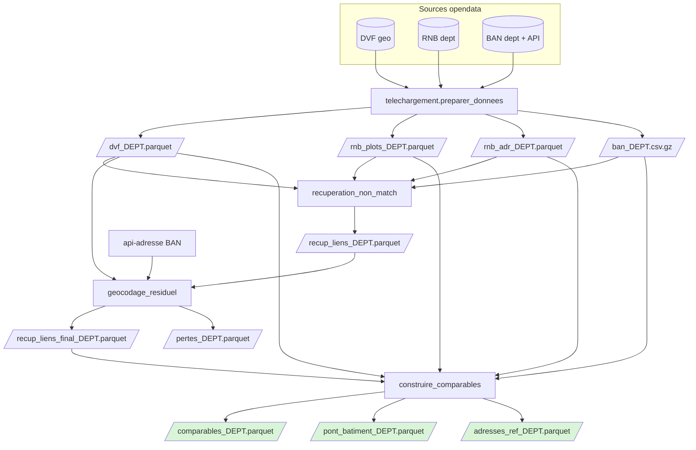
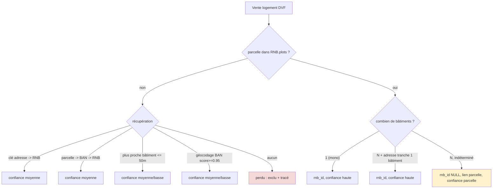

# Pipeline — du foncier brut à la table de comparables

Ce document décrit le pipeline **actuel** : ce qu'il fait, comment il s'enchaîne, les
**choix** qui le structurent et ses **limites**. Pour le *pourquoi* détaillé de chaque
décision, voir les ADR liés ([0001](adr/0001-valider-joignabilite-avant-de-figer-le-socle.md)
→ [0005](adr/0005-organisation-des-donnees-table-comparables.md)).

## But

Produire, **par département**, une table de **comparables immobiliers** centrée sur les ventes
de logement (DVF), chaque vente étant rattachée — quand c'est possible — au **bâtiment** du
Référentiel National des Bâtiments (RNB), avec un niveau de **confiance** explicite. Tout ce
qui n'est pas rattachable de façon défendable est soit localisé à la **parcelle**, soit
**écarté** et tracé (`pertes`).

## Sources

| Source | Rôle | Accès |
| --- | --- | --- |
| **DVF géolocalisé** (Etalab) | les ventes (prix, surface, type, parcelle, coords) | `geo-dvf` CSV/dept/an (2021–2025) |
| **RNB** (IGN/CSTB) | le pivot bâtiment (`rnb_id`), empreinte, parcelles, adresses | export S3 par département |
| **BAN** (DINUM) | crosswalk parcelle↔adresse + géocodage | fichier dept + API `api-adresse` |

## Architecture

```
telechargement/      preparer_donnees.py     # acquisition + parsing brut -> interim
pipeline/
  commun.py          # chemins, points RNB, table mutations (partagés)
  qualite_jointure.py        # [diagnostic] mesure du taux de match
  recuperation_non_match.py  # cascade de récupération A/B/C
  geocodage_residuel.py      # géocodage BAN des résiduels + pertes
  construire_comparables.py  # table comparables + pont + adresses_ref
lancer_pipeline.py   # orchestre tout pour un département
```

## Vue d'ensemble



## Les étapes

| # | Module | Entrée | Sortie | Rôle |
| --- | --- | --- | --- | --- |
| 1 | `telechargement.preparer_donnees` | URLs opendata | `dvf_`, `rnb_plots_`, `rnb_adr_` (parquet) + bruts | télécharge DVF (2021-25), parse le JSON RNB (`plots`, `addresses`), récupère la BAN |
| — | `pipeline.qualite_jointure` *(diagnostic)* | interim | (stdout) | mesure le % de match DVF→RNB par parcelle et décompose les non-matchs |
| 2 | `pipeline.recuperation_non_match` | interim + BAN | `recup_liens_` | récupère les ~2–5% de ventes dont la parcelle est absente du RNB |
| 3 | `pipeline.geocodage_residuel` | `recup_liens_` + DVF + API BAN | `recup_liens_final_`, `pertes_` | géocode le résiduel (score ≥ 0,95) ; le reste = perdu |
| 4 | `pipeline.construire_comparables` | interim + `recup_liens_final_` | `comparables_`, `pont_batiment_`, `adresses_ref_` | assemble la table de service |

### Le cœur : résolution `rnb_id` + confiance

Le rattachement au bâtiment suit une cascade par fiabilité décroissante. Les non-matchs
(parcelle absente du RNB) passent par la récupération (étapes 2-3) ; les matchs directs sont
résolus à la construction (étape 4).



## Modèle de données (sorties)

- **`comparables_{dept}`** — 1 ligne par **bien logement vendu** (dédoublonné des lignes DVF
  éclatées). Colonnes : `id_mutation, date_mutation, nature_mutation, code_commune, nom_commune,
  id_parcelle, adresse_dvf, type_local, surface_reelle_bati, nombre_pieces_principales,
  valeur_fonciere, rnb_id, confiance, source, flag_multi_bien, flag_multi_adresse`.
- **`pont_batiment_{dept}`** — `(id_mutation, id_parcelle) → rnb_id, confiance, source`. Autorité
  du rattachement, **unique par couple** (aucune duplication de ligne en aval).
- **`adresses_ref_{dept}`** — `rnb_id, cle_interop_ban, adresse_normalisee, code_postal,
  nom_commune, lon, lat`, **élagué** aux `rnb_id` réellement référencés (~5-6 % du RNB).
- **`pertes_{dept}`** — ventes non rattachables + `raison`.

## Choix structurants

1. **Pivot = bâtiment RNB (`rnb_id`)**, parcelle = lien secondaire ([ADR 0003](adr/0003-rnb-pivot-batiment.md)).
2. **Parquet canonique + DuckDB en service**, pas de PostGIS ([ADR 0002](adr/0002-parquet-duckdb-comme-moteur-de-service.md)).
3. **Récupération en cascade + seuil de perte 0,95** : un faux rattachement coûte plus cher
   qu'une perte assumée ([ADR 0004](adr/0004-recuperation-non-matchs-dvf-rnb.md)).
4. **Grain = bien logement**, `valeur_fonciere` = total mutation jamais sommé, BAN élagué
   ([ADR 0005](adr/0005-organisation-des-donnees-table-comparables.md)).
5. **Filtres d'emprise poussés dans DuckDB** : tout endpoint de service doit réduire le jeu
   de données le plus tôt possible (bbox SQL avant distance exacte pour les rayons, `code_postal`,
   `code_commune`, préfixe section cadastrale sur `id_parcelle`). Les filtres métier récurrents
   (catégorie, bornes €/m², ventes mono-mutation) se matérialisent ou se calculent côté DuckDB,
   pas par scan départemental suivi d'un filtrage Python.
6. **Pas de désambiguïsation par surface au sol ni BDNB** : mesuré, gain marginal (cf. limites).

## Conventions de service web

Le POC web (`web_poc/`) sert de modèle pour les futures fonctions interactives :

- Les requêtes Estimation et Exploration construisent d'abord une **emprise SQL** commune :
  rayon = préfiltre bbox puis filtre exact `distance_m <= rayon`, code postal, commune, ou section
  cadastrale (`id_parcelle LIKE section%`).
- Les statistiques et l'historique se calculent sur la **cohorte d'emprise**, pas sur tout le
  département. Cela évite de matérialiser des résultats inutiles et reflète mieux la lecture métier.
- Les scans coûteux et réutilisables doivent être **matérialisés**. Exemple actuel : les mutations
  DVF mono-ligne utilisées pour les terrains/dépendances/locaux sont exportées en parquet temporaire
  par département, indexé par taille + date de modification du fichier DVF source.
- Les handlers API renvoient toujours du JSON, y compris en erreur serveur, afin que l'interface
  affiche un état explicite au lieu de rester bloquée sur un calcul en cours.

## Limites (assumées)

- **Précision bâtiment plafonnée à ~60 %.** Sur parcelle multi-bâtiments (62 % des parcelles),
  l'adresse ne tranche que ~46 % et la surface au sol ~33 % ; au-delà = sur-ingénierie. Les
  ~40 % restants sont **localisés à la parcelle** (`confiance=parcelle`, `rnb_id` NULL), souvent
  un cas bénin (maison + son garage au même endroit).
- **Pas de niveau appartement.** DVF n'a pas de n° d'appartement (seulement le lot de copro,
  non joignable). Départager les logements d'un immeuble = itération future (DPE/surface).
- **`valeur_fonciere` est un total de mutation**, répété par ligne — **ne jamais sommer** ;
  `flag_multi_bien` / `flag_multi_adresse` signalent les ventes non décomposables.
- **Dépendance API** (api-adresse) pour l'étape 3 uniquement (résiduel ~quelques centaines/dept).
- **Couverture temporelle DVF 2021–2025** (geo-dvf latest) ; hors champ : terrains, dépendances,
  locaux (filtrés en amont — 68 % des lignes DVF ne sont pas du logement).

## Lancer

```bash
# pipeline complet pour un département
uv run python lancer_pipeline.py 47
uv run python lancer_pipeline.py 47 --mesure      # + diagnostic de joignabilité

# ou étape par étape
uv run python -m telechargement.preparer_donnees 47
uv run python -m pipeline.recuperation_non_match 47
uv run python -m pipeline.geocodage_residuel 47 0.95
uv run python -m pipeline.construire_comparables 47
```

## Résultats mesurés

| | Gironde (33, urbain) | Lot-et-Garonne (47, rural) |
| --- | --- | --- |
| Ventes logement | 126 393 | 28 043 |
| Non-match parcelle | 4,96 % | 2,28 % |
| **Exploitable (après récup.)** | **99,57 %** | **99,84 %** |
| Biens comparables | 138 804 | 31 596 |
| Confiance `haute` (bâtiment sûr) | 57,2 % | 60,1 % |
| Confiance `parcelle` | 38,9 % | 38,4 % |
| `adresses_ref` vs RNB total | ~6 % | ~5,5 % |

Le ratio **~60 % bâtiment / ~39 % parcelle** est stable de l'urbain au rural → modèle généralisable.
